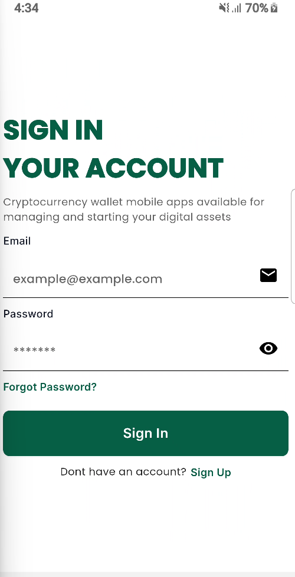
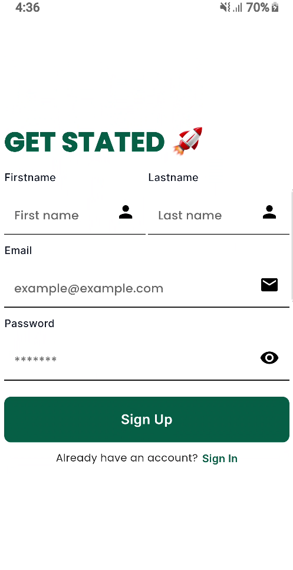

# Splice Free UI

A flutter code base ui for finance application with simple and easy implementation containing the following. This project was highly inspired by Nigerians leading fintech companies like Opay, Palmpay, PiggyVest etc

1. Login
2. Sign-Up
3. Forgot Password
4. Pin Authentication
5. Fingerprint UI
6. Activation screen (Biometric)
7. Welcome Screen with an enable notification ui
8. The home page with the following tabs (Home,Cards, Qr scanning, Transaction History,and Profile).

## User Interfaces

## Sign In



### Sign Up



check Images for more

## Packages

This project uses the following packages

1. Getx
2. elevarm_ui
3. animate_do
4. custom_pin_screen
5. persistent_bottom_nav_bar_v2
6. sticky_grouped_list
7. icons_plus
8. u_credit_card
9. babstrap_settings_screen (An inspiration for the profile screen)

This project was created for easy build and fast production

### Installation

Step one Clone repository

```console
const like = 'sample';
```
